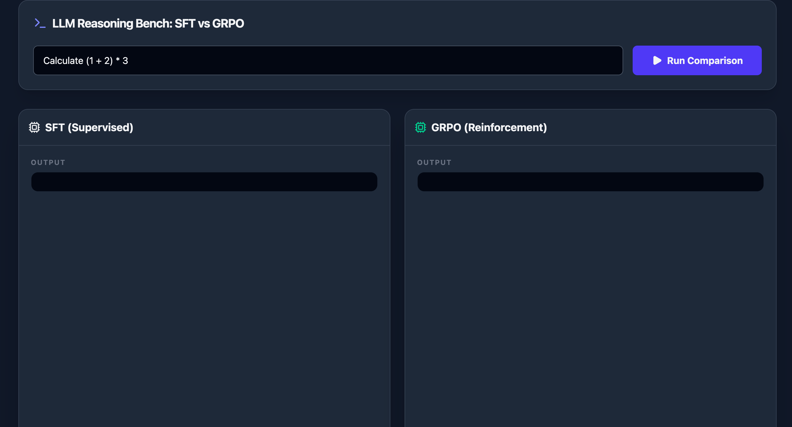

# Frontend implementation

This is a frontend for reasoning-arithmetic built in React, TypeScript, and TailwindCSS.
We can observe the difference between the SFT-trained model and the GRPO-trained model.
Note that this frontend assumes the backend server is running.
Before launching this frontend, please ensure the backend (reasoning-arithmetic-jax) is running.

<div align="center">
 
</div>

# Install

```bash
npm install
```

# Run

```bash
npm run dev
```
